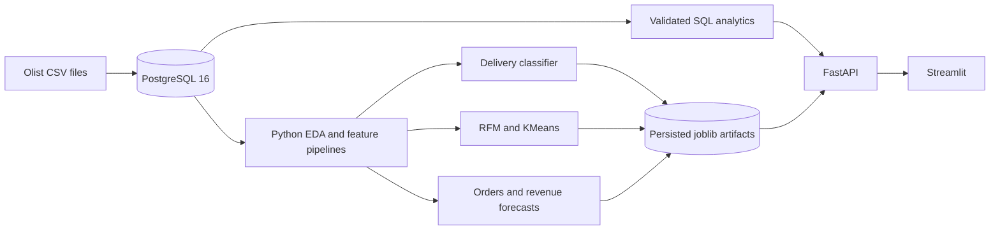

# E-Commerce Intelligence Platform

An end-to-end, locally deployable Data Science portfolio project built on the Olist Brazilian E-Commerce dataset. PostgreSQL, validated SQL, EDA, three persisted machine-learning workflows, FastAPI, Streamlit, and Docker form one interview-ready application.

> This is a historical portfolio analysis and local Docker deployment—not a claim of production operation at Olist.

## Project Summary

Nine relational marketplace files become a governed analytical system. PostgreSQL preserves entity relationships; grain-safe SQL prevents duplicated revenue; Python performs EDA and modeling; FastAPI provides read-only analytics and cached inference; Streamlit communicates KPIs, interactive predictions, and model evidence.

## Business Problems

- Measure marketplace scale, sales development, retention, and delivery performance.
- Prioritize orders with elevated late-delivery risk using pre-dispatch information only.
- Segment customers with fixed-snapshot RFM and KMeans.
- Forecast short-term orders and revenue for fulfillment and cash planning.

## Architecture



FastAPI caches models once per process; API requests never retrain them. Analytical connections explicitly use read-only transactions.

## Dataset

Download the [Olist Brazilian E-Commerce Public Dataset](https://www.kaggle.com/datasets/olistbr/brazilian-ecommerce) and place its nine CSV files in `data/raw/`. Raw data is intentionally excluded from Git and Docker images. Validated source counts include 99,441 orders, 112,650 items, 103,886 payments, and 99,224 reviews.

## Tech Stack

Python 3.12, pandas, NumPy, scikit-learn 1.9.0, PostgreSQL 16, SQLAlchemy, FastAPI, Pydantic, Uvicorn, Streamlit, Plotly, Docker Compose, pytest, and Jupyter.

## PostgreSQL Data Model

The schema retains customer, order, item, product, seller, payment, review, translation, and geolocation grains. Payments are aggregated per order before commercial joins. Category analysis uses item-price GMV rather than attaching full order payments to every item, preventing revenue fan-out. See `database/schema.sql` and `database/queries/`.

## Exploratory Data Analysis

The PostgreSQL-backed EDA covers 98,207 eligible orders, 94,990 unique customers, and R$15,739,137.01 payment revenue. Average order value is R$160.27, repeat rate 3.04%, average delivery time 12.56 days, and late-delivery rate 8.11%. Late deliveries average 2.566 review stars versus 4.294 for on-time/early deliveries. These are associations, not causal estimates.

## Late Delivery Prediction

A leakage-audited Logistic Regression uses 21 purchase-time and pre-dispatch features. Actual delivery/carrier timestamps, reviews, outcomes, targets, and raw identifiers are prohibited. On the untouched chronological test period: PR-AUC 0.1132, ROC-AUC 0.6574, precision 0.0996, recall 0.6646, and F1 0.1733 at threshold 0.55. The model is a prioritization aid, not an automated decision-maker.

## Customer Segmentation

RFM uses a fixed 2018-09-04 snapshot. `log1p` transformation and scaling are persisted with KMeans. k=2 produced silhouette 0.7081 and separated 92,102 one-time customers from 2,888 repeat high-value customers. Rule-based RFM remains useful because it provides more lifecycle detail than two broad clusters.

## Sales Forecasting

Daily eligible orders and revenue are modeled from 2017-01-01 through 2018-08-21 using expanding-window validation and an untouched 30-day holdout. Random Forest order MAE was 40.70 versus 44.12 for SeasonalNaive7. Histogram Gradient Boosting revenue MAE was R$8,024.51 versus R$8,424.68. Thirty-day holdout MAE was 43.03 orders and R$7,720.60 revenue. Uncertainty bands are empirical planning intervals.

## FastAPI

Endpoints include `/health`, five `/analytics/*` routes, `/predict/late-delivery`, `/predict/customer-segment`, and `/forecast?horizon=7|14|30`. Swagger is at [http://127.0.0.1:8000/docs](http://127.0.0.1:8000/docs).

## Interactive Dashboard

The Streamlit platform provides Executive Overview, Sales Analytics, Customer Intelligence, Delivery Risk, Sales Forecasting, Model Performance, and About views using live API responses and persisted evidence.

## Key Business Insights

- November 2017 led complete months with 7,423 orders and R$1.17M revenue.
- Only 3.04% of customers repeated, making second-purchase conversion the main retention opportunity.
- Late delivery coincides with much poorer reviews and varies geographically.
- `health_beauty` led item GMV at R$1.26M.
- Weekly seasonality makes a seven-day seasonal forecast the meaningful benchmark.

## Model Results

| Problem | Selected approach | Validated result |
|---|---|---|
| Late delivery | Logistic Regression | ROC-AUC 0.6574; recall 0.6646 |
| Clustering | log1p + scaling + KMeans k=2 | silhouette 0.7081 |
| Daily orders | Random Forest | backtest MAE 40.70 |
| Daily revenue | Histogram Gradient Boosting | backtest MAE R$8,024.51 |

See [docs/PROJECT_RESULTS.md](docs/PROJECT_RESULTS.md) for the full evidence trail.

## Project Structure

```text
api/          FastAPI application and routers
dashboard/    Streamlit application and API client
database/     PostgreSQL schema and validated SQL
models/       Persisted pipelines and metadata
notebooks/    Executed analytical notebooks
reports/      Metrics, reports, exports, and figures
src/          Ingestion, EDA, features, and ML workflows
tests/        API and dashboard integration tests
docs/         Results, interview, CV, and demo guides
scripts/      Windows startup/shutdown helpers
```

## Quick Start

Requires Docker Desktop with Compose. Python 3.12 is recommended for ingestion and host tests.

```powershell
Copy-Item .env.example .env
# Replace the placeholder password in .env.
docker compose up -d --build
```

Fresh volumes are empty. Download the Olist files into `data/raw/`, then initialize once from the host:

```powershell
python -m pip install -r requirements.txt
python -m src.ingestion.load_data
docker compose restart api dashboard
```

Open [http://127.0.0.1:8501](http://127.0.0.1:8501). Stop without deleting the database volume:

```powershell
.\scripts\stop_app.ps1
```

Native Windows development scripts are `scripts/start_api.ps1` and `scripts/start_dashboard.ps1`.

## API Usage

```bash
curl http://127.0.0.1:8000/analytics/overview
curl "http://127.0.0.1:8000/forecast?horizon=7"
curl -X POST http://127.0.0.1:8000/predict/customer-segment -H "Content-Type: application/json" -d '{"recency":120,"frequency":2,"monetary":250}'
```

The 21-field delivery schema is documented in Swagger.

## Testing

With populated PostgreSQL available:

```powershell
python -m pytest tests -q
```

Tests cover health, database connectivity, all analytics collections, valid and invalid predictions, leakage-field rejection, all forecast horizons, artifact caching, probability bounds, and all dashboard views.

## Limitations

Olist is historical. Promotions, traffic, holidays, weather, campaign exposure, margins, and macroeconomic conditions are absent. Delivery precision is modest; clusters are descriptive; recursive forecast error grows with horizon. Authentication, monitoring, CI/CD, cloud deployment, and drift detection are not implemented.

## Future Improvements

Add CI and linting, container scanning, authentication, secrets management, observability, calibration/drift monitoring, rolling retraining evaluation, campaign experiments, richer regressors, and managed cloud deployment.
